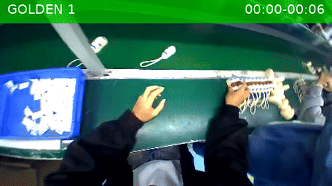
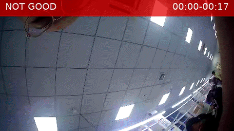

# EgoCut

## Goal

I talked to a YC founder who was collecting egocentric data for embodied agents. He told me they record 8-10 hours of headcam footage per shift, but they could only use a sliver of it — maybe 15-20% ends up being clean enough to actually train on. The rest is the worker looking around, adjusting equipment, chatting, walking between stations, fumbling parts.

And how do they process these videos to get high quality labels? He told me most of the process involves a Gemini API call. Upload the video, describe the task, ask Gemini to identify and timestamp the good segments.

At first it seemed pretty high level. Take the video, figure out what the person is doing, ask Gemini to identify the clean cycles. Simple.

Only issue is that these videos are hours long and most of the content is garbage. Gemini, for all its glory, is expensive at scale. I tested it pretty extensively — I can confidently say it has the best temporal and spatial understanding out of all the large multimodal models, and it's especially good at adjusting to the user's correction in context. But wasting hours of API credits on content that could be weeded out *before* it reaches Gemini is what bothered me. A 10-hour video where 80% is unusable means 8 hours of tokens you're paying for that contribute nothing to the annotation.

So I built something that can process spatial and temporal info cheap, and clean up the content that Gemini sees — so it can concentrate on annotating without breaking the bank on expensive long-context calls that happen to be the standard right now.

The goal is to build something like an anomaly detection system — a binary classifier that watches egocentric factory video and tells you, in real time, whether what the camera is seeing right now is a clean, usable action cycle — or not. It flags the good stuff and filters out the noise before it ever reaches the expensive annotator.

This matters because if you want to train a robot to do the same task, you need thousands of clean demonstrations. But factory headcam footage is noisy. Workers look away, adjust their headgear, chat with coworkers, restock materials, fumble parts. Even when they're actively working, the camera might be pointed slightly wrong, a support beam might block the view, or the cycle might be incomplete. You need to automatically separate the wheat from the chaff — the "golden" segments from everything else.

Previous attempts failed. Single-frame classification didn't work because static hand poses are ambiguous — "hand reaching for headgear adjustment" looks identical to "hand reaching for device casing" in a single frame. A second attempt using VJEPA2 with cosine similarity sliding windows also failed: it detected anomalies initially but then normalized to them. After 2 seconds of "not working," the sliding window treated "not working" as the new baseline and stopped flagging it. The fix is discriminative classification (frozen VJEPA2 backbone + learned probe), not similarity-based detection.

The approach: use Meta's V-JEPA 2 (a self-supervised video encoder trained on 1M+ hours of video) as a frozen backbone. Train a tiny 578K-parameter classifier on top to flag which 8-second windows are "Golden Standard" (perfect camera angle, full work cycle, zero occlusion, steady gaze) and which aren't worth sending to Gemini at all. The encoder stays frozen — I only train the lightweight probe that sits on top. The encoder never sees our data during pretraining — it just learns general video understanding. We teach it what "golden" means with a few hundred labeled clips.
Again, this isnt to replace Gemini itself, its just a cheap way to filter out noise before it even reaches Gemini.
---

Cheap spatiotemporal filtering for egocentric factory video — so Gemini only annotates what matters.



*factory001 — ring insertion (golden=green, rejected=red)*



*factory008 — battery insertion*

---

## Key Numbers

| Metric | Value |
|--------|-------|
| Factories | 9 (dropped 006 and 010) |
| Total videos labeled | 63 |
| Training clips (50% overlap) | 1,182 |
| Validation clips | 390 |
| Test clips | 396 |
| Encoder | V-JEPA 2 ViT-g 384px (1B params, frozen) |
| Probe | 578K params (128-dim, 2-layer attentive) |
| Test accuracy | 0.60 |
| Test F1 (golden) | 0.65 |
| Test precision (golden) | 0.53 |
| Test recall (golden) | 0.84 |
| Best factory F1 | 0.85 (factory011, cylinder scraping) |
| Worst testable factory F1 | 0.33 (factory005, box packaging) |
| Gemini labeling cost | ~$6 total for 60 videos |
| Gemini cache tokens | ~84K (2 videos + conversation) |

---

## Running

```bash
pip install -r requirements.txt
export GEMINI_API_KEY=your_key   # or set in .env
bash run.sh
```

| Stage | Command | What it does |
|-------|---------|-------------|
| Label only | `./run.sh label` | Build cache + batch-label unlabeled videos |
| Train only | `./run.sh train` | Clips → features → probe |
| Full pipeline | `./run.sh` | All of the above |
| 50% overlap | `OVERLAP=0.5 ./run.sh train` | Double training clips |
| Single video | `python label_cache.py <path>` | Label one video with cache |
| Verify labels | `python verify_labels.py labels/factory001/factory_001_worker_001_0076.json egocentric/val/factory001/factory_001_worker_001_0076.mp4` | Overlay labels on video |

Requires: GPU with ~12GB VRAM for `extract.py`. Everything else is CPU.

---

## Table of Contents

- [Running](#running)
- [Goal](#goal)
- [What I Tried That Didn't Work](#what-i-tried-that-didnt-work)
- [What Worked: V-JEPA 2](#what-worked-v-jepa-2)
- [The Dataset](#the-dataset)
- [Defining Golden Standard](#defining-golden-standard)
- [Video Preprocessing](#video-preprocessing)
- [Gemini Calibration Labels](#gemini-calibration-labels)
- [Scaling Labels with Context Caching](#scaling-labels-with-context-caching)
- [Batch Labeling](#batch-labeling)
- [The Factory006 Problem](#the-factory006-problem)
- [V-JEPA 2 Feature Extraction](#v-jepa-2-feature-extraction)
- [Training the Probe](#training-the-probe)
- [Per-Factory Results](#per-factory-results)
- [What Worked](#what-worked)
- [Where It Struggled, and Why](#where-it-struggled-and-why)
- [Next Steps](#next-steps)
- [Task Reference](#task-reference)
- [Repository Structure](#repository-structure)
- [References](#references)

---


## What I Tried That Didn't Work

Before landing on V-JEPA 2 with an attentive probe, I went through a bunch of research papers trying to find something that could segment or filter egocentric factory video. Each one had a specific reason it broke.

**LAPS** ([Shukla et al., 2025](https://arxiv.org/abs/2511.21428)) — Latent Action-based Primitive Segmentation. LAPS computes an "action energy" signal from quantized motion tokens: track 400 points with CoTracker, encode their velocities into a latent code, measure how fast the code changes between frames. When energy is high, an action is happening. When it drops, the action ended.

On fixed-camera industrial video, this works beautifully — 81% F1. But on egocentric video, the energy calculation breaks. The headcam is always moving. Even when the worker's hands are completely still, every tracked point shifts because the head sways. The energy signal never reaches zero. The hysteresis detector thinks there's ALWAYS an action happening, so it either detects no boundaries or puts them in the wrong places. LAPS on the egocentric GTEA benchmark drops to 63% F1 — and that's kitchen video where head motion is mild compared to a factory floor. Additionally, CoTracker's tracking accuracy on egocentric sequences drops from ~75% to ~38.5% (per EgoPoints, WACV 2025). The whole signal chain is corrupted before the detector even runs.

**AMPLIFY** ([Dalal et al., 2025](https://arxiv.org/abs/2506.14198)) — Action-conditioned Motion Prediction with Large-scale Internet Footage Yielding robotic policies. AMPLIFY builds on the same CoTracker → velocity → tokenizer pipeline that LAPS uses. Its motion tokenizer encodes point velocities into FSQ-quantized codes (2048 codebook, 768-dim). The decoder predicts where each point moved within a 15×15 pixel window.

Four things break with egocentric data: (1) the 15×15 displacement window overflows — head shake produces ±30px of global motion while the window only covers ±7px, so points get clipped and the latent code is corrupted; (2) the energy baseline never reaches zero because ego-motion is constant; (3) the 2048 FSQ codes were learned on calm exocentric data, so most egocentric frames map to the same few "high motion" codes, destroying codebook diversity; (4) the same task performed with different head movements produces different latent vectors, so clustering assigns the same action to different categories. All four trace to one root cause — the velocity input mixes hand motion with ego-motion, and the encoder can't tell them apart.

**TEAMs** ([Paper, 2025](https://arxiv.org/pdf/2504.05956)) — designed for few-shot temporal action recognition on short, trimmed clips. TEAMs assumes the video IS the action — given a 5-second clip, classify it. My problem is the opposite: given hours of untrimmed video, FIND where actions are. TEAMs has no mechanism for temporal localization in long video. Its pattern tokens could theoretically help compare candidate segments to a reference after detection, but it can't do the detection itself.

**LongVILA** ([Zhang et al., 2024](https://arxiv.org/abs/2408.10188)) — a method to increase the processing power of VLMs by long context extension and long video supervised fine-tuning. The idea: extend a VLM's context window to 262K tokens so it can process ~1400 frames at once, then fine-tune on long video understanding.

The problem: Stage 5 training (where long video understanding actually happens) requires 8×A100 80GB with sequence parallelism. A single 1400-frame sample is 274K tokens. I tried INT4 quantization on a 3090 to at least run inference — discovered that VILA's custom `post_config()` calls `.to(torch.float16)` on the entire model after loading, which dequantizes bitsandbytes weights back to fp16, killing the VRAM savings. After monkey-patching that, inference barely fits, but the model was trained on YouTube videos (Shot2Story) and produces generic descriptions when shown factory footage. It doesn't understand "this is a clean repetitive cycle" vs "the worker is adjusting their headgear" — it just says "a person is working at a machine." Fine-tuning on factory data to teach it this distinction would require the multi-GPU setup I don't have.

---

## What Worked: V-JEPA 2

V-JEPA 2 (Meta FAIR, June 2025) is a self-supervised video encoder pretrained on over 1 million hours of video. It learns to predict masked video patches in feature space — mask out random spacetime regions and the model learns to reconstruct what should be there from the visible parts. No text labels, no language supervision. Just video.

Why this model specifically:

1. **It processes 16 frames simultaneously.** Each frame gets patchified into 16×16-pixel blocks, and these patches across all 16 frames become spatiotemporal tubelets. Self-attention runs across ALL of them — a patch at frame 5 can attend to the same spatial location at frame 14. The model learns temporal dynamics natively, not as an afterthought.

2. **It was trained on egocentric video.** The pretraining dataset (VideoMix22M) includes Something-Something V2 — 168K egocentric hand-object interaction videos. The model already understands hands doing things from a first-person viewpoint. It achieves SOTA on EK100, an egocentric cooking benchmark.

3. **Unlike LAPS/AMPLIFY, it doesn't track individual points.** There's no CoTracker, no velocity field, no pixel-level tracking that ego-motion can corrupt. V-JEPA 2 operates directly on raw pixels and internally learns what matters. Head turns don't cause the embedding to shift dramatically because the semantic content (same phase of same task) hasn't changed.

4. **It's frozen.** I don't need to train or fine-tune a billion parameters. I extract features once and train a 578K-parameter probe on top. The entire training loop takes minutes, not days.

The specific model: ViT-g at 384px — 1 billion parameters, 1408-dimensional embeddings, ~12GB VRAM for inference. Loaded via `torch.hub` (not HuggingFace) because the HF wrapper bakes in a fixed 64-frame-per-clip constraint that doesn't match my 16-frame setup.

```python
result = torch.hub.load("facebookresearch/vjepa2", "vjepa2_vit_giant_384")
model = result[0]  # encoder only, discard predictor
```

---

## The Dataset

**Source:** [builddotai/Egocentric-100K](https://huggingface.co/datasets/builddotai/Egocentric-100K) on HuggingFace. 100K+ hours of factory egocentric video across 11 factories, 7-57 workers each. Videos are ~180 seconds, 30fps native, 456x256 pixels, fisheye lens, H.265 codec. Stored as WebDataset tar archives on HuggingFace, one tar per worker.

I initially surveyed all 11 factories. Factory010 (cable packaging) got dropped immediately — the task happens mostly outside the camera's field of view, so the video quality was unusable. That left 10 factories.

**Extraction:** `extract_dataset.py` downloads tars from HuggingFace and extracts specific videos. We needed to discover the tar file paths first — each worker's videos are packed into a single tar, and the naming isn't obvious. Factory001/worker002's tar path wasn't in the initial inspection output (truncated), so the script discovers it at runtime via the API.

**Split design:**

| Split | Worker | Videos per Factory | Total | Purpose |
|-------|--------|--------------------|-------|---------|
| Train | worker_001 | 3 (sequential: 0000-0002) | 33 | Learn classification |
| Val | worker_001 | 2 (0003 + last video) | 22 | Tune threshold, early stopping |
| Test | worker_002 | 2 (first 2 available) | 22 | Cross-worker generalization |

Total: 77 videos, ~2.2 GB.

**Why sequential training videos** (0000, 0001, 0002) instead of random: same shift segment means consistent lighting, camera angle, and worker behavior. Random sampling would risk crossing shift boundaries where conditions change.

**Why worker_002 for test:** this is the minimum viable generalization test. Same task, same station, different person. If the model can't transfer from one person to another doing the same task, the approach is fundamentally broken. This is harder than same-worker held-out videos but easier than cross-factory transfer.

**Why the last val video per factory** is special: that's the one with existing Gemini calibration labels (explained below), enabling direct comparison between human-verified labels and model predictions.

```
egocentric/
├── train/
│   ├── factory001/   (3 videos: 0000, 0001, 0002)
│   ├── factory002/   (3 videos)
│   └── ...
├── val/
│   ├── factory001/   (2 videos: 0003 + 0076)
│   └── ...
└── test/
    ├── factory001/   (2 videos: worker_002)
    └── ...
```

---

## Defining Golden Standard

I started with simple "working" vs "not working" but that turned out to be too coarse. A worker can be actively working but if the camera is turned slightly wrong, a support beam blocks the view of their hands, or the cycle is half-complete, that footage is useless for training a robot. I needed something stricter.

After manually reviewing factory001 (electronics assembly — pressing rings into casings on a conveyor), I landed on four criteria:

1. **Full Temporal Cycle** — the segment must contain a complete pick-manipulate-release cycle, not a fragment. It starts when hands begin the action and ends when the object is released and hands return to neutral position.

2. **Gaze Stability** — the worker's head (and therefore the camera) must stay locked on the task zone. If the worker looks away from the manipulation zone for more than 0.5 seconds, the segment is cut. This is strict — even a brief glance at a coworker kills it.

3. **Zero Occlusion** — the primary action (point of contact between hands and objects) must be fully visible. If any part of the assembly line — white support posts, bins, equipment, other workers' arms — blocks the view of hands making contact with components, the segment is removed.

4. **Optimal Framing** — hands must remain within the central 60% of the frame throughout. If the action happens at the extreme edges or goes off-screen, the segment is discarded.

The key insight was that "golden" is much stricter than "the worker is doing their job." Most of the time the worker IS doing their job. But the camera angle, gaze direction, or equipment positioning makes that particular moment useless for training an action recognition model. In the calibration video for factory001, only 17% of the video was Golden Standard — and the worker was actively assembling rings for almost the entire 3 minutes.

**"Not good for collecting" includes:**
- Headgear adjustments, looking at neighbors, restocking materials
- Water breaks, chatting, idle hands, walking
- Incomplete cycles, fumbled attempts
- Camera blur from rapid head movement
- Structural occlusion (support beams, equipment blocking view)
- Hands leaving the frame, off-screen action
- Sorting bulk materials, organizing workspace

---

## Video Preprocessing

The raw 456-pixel-wide fisheye frame captures workers at adjacent stations doing completely different tasks. This confuses both Gemini (it would describe the neighbor's actions) and V-JEPA 2 (it sees motion from multiple people). Fisheye distortion is worst at the edges, exactly where the neighbor activity is. The top of the frame often shows the torso or equipment of the worker at the station behind.

I center-crop: remove 100 pixels from each side (456 → 256 wide) and trim from the top. Tested three trim levels — 0px, 20px, and 36px:

- **trim=0:** neighboring worker's torso and adjacent equipment clearly visible at top of frame
- **trim=20:** clean — removes the neighbor while keeping the full workspace visible. Factory007 has slight neighbor bleed-through even at 20px, but acceptable
- **trim=36:** too aggressive — starts cutting into the worker's own hands during overhead reaches

**Decision: 20px top trim.** Final ffmpeg filter: `crop=256:236:100:20,scale=256:256`

The 236→256 vertical rescale introduces about 8% stretch, imperceptible visually and well within V-JEPA 2's augmentation tolerance (it was trained with random crops and resizes far more aggressive than 8%).

One important benefit: this crop aligns Gemini labeling with V-JEPA 2 training. Both see the exact same 256x256 frame, so there's no mismatch between what was labeled and what the model learns from.

**Sampling rate:** Fixed 2fps for all factories, regardless of task speed.

At 2fps, a 16-frame V-JEPA 2 clip covers exactly 8 seconds. What does 8 seconds show for different tasks?

| Task Speed | Cycle Time | What 8s Shows |
|-----------|-----------|---------------|
| Fast | 2.2-4.4s (factory001, 008) | 2-3 full cycles |
| Medium | 6.1-13.4s (factory003-005, 007, 009) | ~1 full cycle |
| Slow | 17.2-22.0s (factory002, 011) | ~half a cycle |

**Why fixed 2fps, not per-task:** at deployment, the system won't know which task is being performed. A fixed FPS means the model sees a consistent temporal resolution regardless of task. FPS becomes a deployment config, not a model hyperparameter.

**Why 2fps specifically:** 4fps gives a 4-second window (misses context on slow tasks like panel lamination at 22s cycles). 1fps gives a 16-second window (too coarse for fast 2.2s cycles — you'd average over 7+ cycles and lose all boundary information). 2fps is the sweet spot.

Each ~180s video yields ~22 non-overlapping clips at 2fps. 77 videos produce ~1,700 clips total.

---

## Gemini Calibration Labels

I hand-labeled one video per factory in a Gemini chat session (`gemini-3-flash-preview`), then scaled to the remaining 60+ via API.

**The factory001 correction loop — this was the critical moment that made everything else possible:**

1. I uploaded the cropped factory001 video (electronics assembly — pressing rings into casings) and asked Gemini to apply the Golden Standard protocol.

2. Gemini's first attempt was too loose. It included segments with subtle gaze shifts (00:00-00:02 where the camera is still settling), segments with structural occlusion (00:13-00:15 where the white support beam blocks the view), and missed the best segments entirely. It was labeling "worker is working" not "this is a clean, usable demonstration."

3. I corrected it by pointing to timestamp 02:22-02:29 — the "Master Golden Segment." Two full, uninterrupted textbook cycles with perfect centering, zero occlusion, and steady gaze. I told Gemini: "That is what Golden Standard looks like."

4. I provided the full corrected labeling for factory001 (9 golden segments totaling ~30 seconds out of 179s — only 17% golden).

5. Gemini internalized the correction and articulated three hard-fail rules on its own:
   - **Gaze Shift:** if the worker looks away from the task zone for even 0.5 seconds, the segment is immediately cut
   - **Structural Occlusion:** the white support beam at center-left frequently blocks the Pick phase — any frame where hands disappear behind this beam means discard
   - **Boundary Truncation:** if the hand starts a Pick or finishes a Place action off-camera or at the frame edge, the segment is discarded

6. On factory002 (panel lamination with blue roller), I provided the golden template timestamp (0:03-0:24) and task description. Gemini produced correct labels without any further correction. Zero corrections needed.

7. From factory003 onward, the same pattern held: provide video + task description + golden template timestamp → accurate labels. The meta-criteria had been learned from one correction.

**Label format:** JSON list covering every second of the video. Golden segments get a `segment_id` and `description`. All other segments are labeled "not good for collecting." Timestamps are `MM:SS` strings, inclusive. No gaps, no overlaps — every second must be in exactly one segment.

```json
[
  {
    "start_time": "00:00",
    "end_time": "00:04",
    "label": "not good for collecting"
  },
  {
    "segment_id": 1,
    "start_time": "00:05",
    "end_time": "00:08",
    "label": "Golden Standard",
    "description": "Single perfect repetition; centered framing and clear thumb-press."
  }
]
```

**Golden Standard coverage varies wildly by factory:**

| Factory | Task | Golden Seconds | Total Video | % Golden |
|---------|------|---------------|-------------|----------|
| 001 | Electronics assembly | ~30s | 179s | 17% |
| 002 | Panel lamination | ~88s | 129s | 68% |
| 003 | PCB frame assembly | ~85s | 179s | 47% |
| 004 | Industrial sewing | ~100s | 179s | 56% |
| 005 | Box packaging | ~48s | 179s | 27% |
| 006 | Lever press | ~20s | 179s | 11% |
| 007 | Motor housing | ~45s | 179s | 25% |
| 008 | Battery insertion | ~82s | 179s | 46% |
| 009 | Glue sealing | ~143s | 179s | 80% |
| 011 | Cylinder scraping | ~139s | 179s | 78% |

Factory001 and factory006 have thin golden coverage. Factory009 and 011 are mostly golden — those workers barely look away. This distribution matters for training (class imbalance per factory).

**Verification:** `verify_labels.py` overlays the label JSON on the video with a green bar for Golden Standard and red bar for not-good. You can scrub through the full video to check boundaries.

---

## Scaling Labels with Context Caching

I used Gemini's explicit context caching to scale to 60+ videos. The cache contained:

- A **system instruction** encoding the four Golden Standard criteria with the output format specification
- The **full factory001 video** (3 min, cropped to 256x256) + the entire correction conversation: Gemini's bad first attempt → my correction pointing to 02:22-02:29 → Gemini articulating the hard-fail criteria
- The **full factory002 video** (3 min, cropped) + the zero-correction success: task description + golden template → correct labels on first try

Factory003 was deliberately held out — it was my validation target to verify the cache worked.

**Why explicit caching over implicit:** explicit caching guarantees a 50% token discount on the cached content and gives full control over exactly what's cached and its TTL. The two full 3-minute videos plus the conversation text cost ~84K tokens in the cache.

**Why only factories 001-002 in the cache:** minimal viable context. One correction (001) teaches the criteria and shows what "wrong" looks like. One success (002) proves the model learned and can generalize to a new task. Adding more factories would increase cache storage costs without meaningfully improving labeling quality — the criteria are task-agnostic.

**Cache TTL: 2 hours.** Enough to label a full batch in one sitting.

**The model mismatch discovery:** I initially built the cache with `gemini-2.5-pro` because it seemed like the stronger model. But the original calibration chat — where Gemini actually learned the criteria — used `gemini-3-flash-preview`. The cache model has to match the model that learned the criteria. When I tested 2.5-pro on factory003 (held out), it was way too loose — 143 seconds golden (80%) compared to the ground truth of 85 seconds (47%). It missed the entire 00:49-01:30 not-good zone.

Rebuilt the cache with `gemini-3-flash-preview` and the results aligned much better:

| Metric | Ground Truth | Gemini 2.5 Pro | Gemini 3 Flash |
|--------|-------------|----------------|----------------|
| Golden seconds | 85s | 143s | 99s |
| % Golden | 47% | 80% | 55% |
| Segments | 7 | 11 | 8 |

Flash caught the major not-good zones that Pro blew through. It still merges through some 1-second gaps (my ground truth cuts at single-frame gaze shifts that Gemini can't resolve at video resolution), but at 8-second clip resolution these per-second differences vanish.

Factory004 (sewing) showed a different issue: Flash missed the first 43-second golden segment entirely and shifted the remaining boundaries. Sewing looks very different from the electronics assembly that dominates the cache context. The cache learned "electronics assembly criteria" not "universal criteria." But at clip level (8-second windows), the boundary shifts average out enough to be usable.

**Validation was staged:**
- Gate 1: Test on factory003 (held out from cache) — compared to ground truth labels
- Gate 2: Spot-check a few more factories to verify consistency
- Gate 3: Full batch run on all remaining videos

---

## Batch Labeling

`label_batch.py` scans `egocentric/{train,val,test}/` for videos, skips any that already have labels, and labels the rest via the cached calibration context. For each video, it:

1. Center-crops the video to 256x256 (matching the cache's visual context)
2. Uploads it to Gemini's file API
3. Sends a prompt with the factory's task description + average cycle time, referencing the cache
4. Parses the JSON response and validates coverage (should be ~100%)
5. Saves the label to `labels/{factoryXXX}/{video_id}.json`
6. Deletes the uploaded file from Gemini's servers
7. Waits 5 seconds before the next request (to avoid rate limits on the free tier)

**Results: 60/60 videos labeled successfully.** Zero failures. Each video took ~30 seconds to process (upload + inference + response). Coverage was 100-101% across all videos — complete temporal coverage, no gaps, no overlaps.

**Cost:** Each video is ~47K input tokens (180s × ~258 tokens/s of video) plus ~3K output tokens. With the cache providing a 50% discount on the 84K cached tokens, total cost for 60 videos was approximately $6.

Golden time distribution varied wildly — from 8% to 89% depending on the worker and task complexity. Some workers barely look away (factory009, glue sealing), while others have frequent interruptions (factory001, electronics assembly on a busy conveyor line).

---

## The Factory006 Problem

The calibration video (factory_006_worker_001_0078) showed a manual lever-press stamping task — worker places a vial, pulls a lever, inspects the result. Only 11% golden time (20 seconds out of 179). Very specific task.

But some of the batch-labeled training videos had wildly different numbers. One video (factory_006_worker_001_0002) scored 89% golden with 32 segments. That's suspicious — it would mean the worker was performing near-perfect lever presses for 160 out of 180 seconds with 32 clean cycles. The calibration video only had 4 clean cycles.

I overlayed the labels on the video and confirmed: **the train/val/test videos for factory006 showed a completely different task than the calibration video.** The calibration video was a lever press; the training videos appeared to be some other assembly task. The dataset has inconsistent content across videos for this factory.

The API labels were probably correct for the actual video content (the model was labeling what it saw), but they didn't match the calibration criteria because the calibration was done on a different activity. Training on these labels would teach the probe confused criteria.

**Decision: drop factory006 entirely.** 9 factories, 63 labeled videos. Better to have consistent labels across fewer factories than noisy labels polluting the training signal. The factory006 calibration label was also removed from the repo.

---

## V-JEPA 2 Feature Extraction

**Feature extraction pipeline (per clip):**

1. **Read 16 frames** from the cropped video starting at `clip_start_s`, sampled at 2fps using decord. Native video is 30fps, so we take every 15th frame.

2. **Resize from 256x256 to 384x384** using bilinear interpolation. The model was pretrained at 384px resolution. I considered bicubic (slightly sharper) but bilinear is faster and the quality difference is negligible for features.

3. **Normalize with ImageNet statistics** (mean=[0.485, 0.456, 0.406], std=[0.229, 0.224, 0.225]). Standard for all vision transformers pretrained with ImageNet-normalized inputs.

4. **Forward through frozen encoder with autocast** (mixed precision for memory efficiency) → output shape: (1, 4608, 1408). That's 4608 patch tokens, each 1408-dimensional.

5. **Reshape** (1, 4608, 1408) → (1, 8, 576, 1408). The 4608 patches decompose into 8 temporal tokens × 576 spatial tokens per frame (24×24 spatial grid from 384px with 16px patches).

6. **Spatial average pool** → (8, 1408). Average over the 576 spatial positions per timestep, keeping the 8 temporal tokens.

**Why spatial averaging — the critical tradeoff:**

Storing all 4608 × 1408 features per clip would be ~26MB each, ~13GB for 500 clips. That's impractical for disk, impractical for GPU memory during probe training, and means you need a much larger probe to handle 4608 input tokens.

Spatial averaging reduces each clip to 8 × 1408 = ~45KB. That's manageable — 22MB total for 500 clips, fits in GPU memory trivially.

The tradeoff: I lose spatial information about WHERE things are in the frame. Golden vs not-good is partly about spatial positioning — hands centered vs reaching to the edge, gaze on-task (center of frame) vs shifted (hands at periphery), support beam occluding the center. By averaging over all spatial positions, I collapse exactly this signal. I retained temporal patterns (which do matter — "hands doing centered task" vs "head turning away" plays out as a temporal sequence even after spatial averaging). But I lost the spatial dimension that could have been very informative. This became a primary explanation for the results.

**Clip construction:** 8-second non-overlapping clips from each video. Binary label: golden if >50% of the clip's seconds are Golden Standard, else not-good.

For the final training run, I used **50% overlap (stride=4s) for training clips only**. This doubles training data from ~591 to ~1182 clips. Overlapping clips are correlated (they share 4 seconds of video), but they give the model more boundary examples. Val and test clips stayed non-overlapping to keep metrics honest.

```bash
python make_clips.py --overlap 0.5   # 50% overlap for train, non-overlapping val/test
```

---

## Training the Probe

**Stage 1 — Logistic Regression Baseline:**

Before training anything complex, I needed to answer: do the V-JEPA 2 features actually separate golden from not-good at all? If a linear classifier can't find any signal, no amount of architecture will help.

Mean-pool the 8 temporal tokens → single 1408-dim vector per clip → StandardScaler → logistic regression. Tuned regularization C across [0.001, 0.01, 0.1, 1.0, 10.0, 100.0].

With non-overlapping clips (591 train): val F1 0.37, test F1 0.48. With overlapping clips (1182 train): val F1 0.34, test F1 0.26. Weak, but above chance (always-predict-majority-class gives 0.45 accuracy). The features encode something. Interestingly, overlap *hurt* the linear model — the correlated samples confused the regularization. But the signal was confirmed.

**Stage 2 — Attentive Probe:**

The V-JEPA 2 paper evaluates with an "attentive probe" — a small transformer that attends to the temporal features. Their version: 4 transformer blocks (3 self-attention + 1 cross-attention with a learnable query token), matching the encoder's 1408-dim, 16 heads. Designed for 170K training videos on Something-Something V2.

**First attempt — too big:** Paper config: project 1408→384, 4 layers, 6 heads, 0.2 dropout. 7.64 million parameters. Collapsed immediately — learned to predict "golden" for everything at epoch 1 and never recovered. Classic overparameterization on small data.

**Second attempt — scaled down aggressively:**

| Parameter | Paper Config | Mine | Why |
|-----------|-------------|------|-----|
| Projection dim | 1408 (no projection) | 128 | Reduce capacity |
| Depth | 4 layers | 2 (1 self-attn + 1 cross-attn) | Prevent overfitting |
| Heads | 16 | 4 | Scale with dim |
| Dropout | 0.0-0.1 | 0.4 | Aggressive regularization |
| Total params | ~25M+ | 578K | 43x smaller |

Training config:
- **Optimizer:** AdamW, lr=3e-4, weight_decay=0.1 (high weight decay for regularization)
- **Scheduler:** CosineAnnealingLR over 200 epochs
- **Batch size:** 64
- **Class-weighted loss:** not-good=1.0, golden=1.84 (based on training distribution: ~35% golden, ~65% not-good)
- **Gradient clipping:** 1.0
- **Early stopping:** patience=30, with a critical guard — the model must predict BOTH classes to count as a valid checkpoint. If it predicts all-golden or all-not-good, that epoch's checkpoint is rejected even if F1 is high.

**Results (1182 train clips with 50% overlap, non-overlapping val/test):**

| Split | Accuracy | Precision (golden) | Recall (golden) | F1 (golden) |
|-------|----------|---------------------|-----------------|-------------|
| Val | 0.61 | 0.54 | 0.69 | 0.61 |
| Test | 0.60 | 0.53 | 0.84 | 0.65 |

The model is biased toward predicting golden (84% recall but only 53% precision), meaning it's too generous — it calls many not-good clips golden. But it's calibrated enough to be useful as a first-pass filter. Best checkpoint was epoch 2 — peaked very early and overfit from there, consistent with limited training data.

---

## Per-Factory Results

| Factory | Task | Avg Cycle | Acc | F1 | Golden/Total | Primary Issue | Fix |
|---------|------|-----------|-----|-----|--------------|---------------|-----|
| factory004 | Industrial sewing | 13.4s | 0.75 | 0.83 | 28/44 | — | — |
| factory011 | Cylinder scraping | 17.2s | 0.75 | 0.85 | 32/44 | — | — |
| factory002 | Panel lamination | 22.0s | 0.61 | 0.71 | 27/44 | Transition confusion at cycle boundaries | More boundary examples in training |
| factory007 | Motor housing | 11.3s | 0.64 | 0.71 | 23/44 | Routing vs inspection looks similar | Spatial features (center vs edge attention) |
| factory003 | PCB assembly | 12.0s | 0.50 | 0.65 | 20/44 | Brief insertion (~2s) surrounded by reaching | Spatial features + finer clips |
| factory001 | Ring insertion | 3.1s | 0.52 | 0.55 | 22/44 | 3s cycles in 8s windows → noisy labels | 4fps / 4s clips |
| factory008 | Battery insertion | 3.0s | 0.41 | 0.46 | 16/44 | Fastest task, continuous motion, no pauses | 4fps / 4s clips |
| factory005 | Box packaging | 11.5s | 0.34 | 0.33 | 8/44 | Only 8 golden test clips — data issue | More test data |
| factory009 | Glue sealing | 6.1s | 0.86 | 0.00 | 2/44 | Only 2 golden test clips — untestable | More test data |

The pattern: factories with longer, visually distinctive cycles (sewing 13.4s, scraping 17.2s) hit 0.83-0.85 F1 because the visual difference between golden and not-good is large and the 8-second window captures clean sub-sequences. Factories with ultra-fast 3-second cycles (ring insertion, battery insertion) struggle because almost every clip straddles golden and not-good — the binary label itself becomes noisy. Factory005 and factory009 are data issues, not model issues.

---

## What Worked

1. **The Gemini calibration loop was highly effective.** One correction on factory001 was enough to teach the criteria. The model articulated the hard-fail rules on its own and generalized to 8 other factory tasks without further correction. This is a strong argument for few-shot visual instruction — you don't need to label thousands of examples; you need to show one good example, one correction, and let the model generalize.

2. **Context caching gave us consistent labels at scale.** 60 videos, zero failures, ~$6 total, 50% token discount. The two-factory cache (one correction + one success) was sufficient context. More factories in the cache would have increased cost without improving quality.

3. **V-JEPA 2 features do encode task-relevant information.** The ViT-g encoder, pretrained on 1M+ hours of video without any task-specific labels, produces features that separate golden from not-good above chance. The signal is real — the logistic regression baseline confirmed it, and the attentive probe amplified it.

4. **Factory004 and factory011 hit 0.83-0.85 F1.** For tasks with long, visually distinctive cycles, the full pipeline — Gemini labeling → VJEPA2 features → attentive probe — works. These are deployable numbers for a first-pass filter (flag segments for human review, not autonomous operation).

---

## Where It Struggled, and Why

The struggles are NOT failures of the approach — they trace back to specific, identifiable causes:

1. **Spatial averaging discards the wrong information.** Golden vs not-good is partly about WHERE things are in the frame — hands centered vs reaching to the edge, gaze on-task vs shifted. We averaged over all 576 spatial positions per timestep, collapsing exactly the positional signal that matters. The temporal signal (8 tokens × 1408-dim) captures WHEN things change but not WHERE they are in the frame. This is the single biggest architectural limitation and the most obvious thing to fix.

2. **Small training set limits the probe.** ~1182 clips (416 golden) is thin for even a 578K parameter model. The attentive probe peaked at epoch 2-4 and overfit from there. It never got a chance to learn subtle patterns because it memorized the training set first. More data would help directly.

3. **Label noise from Gemini.** The API labels are approximately 85% accurate per-second compared to hand-verified ground truth. At clip level this becomes ~90-95% (most per-second errors happen at boundaries, and the >50% threshold smooths them). But it's still a ceiling — the probe can't learn to be more accurate than its training labels.

4. **Fast-cycle factories have a granularity mismatch.** Factory001 and factory008 have 3-second cycles. At 8-second clip resolution, almost every clip contains both golden and not-good seconds. The binary label becomes unreliable — it depends on which 3-second boundary the clip happens to straddle. This isn't a model failure; it's a resolution mismatch. Shorter clips (4s at 4fps) would help these factories specifically.

---

## Next Steps

1. **Keep spatial features** — instead of averaging over 576 spatial tokens, use a spatial attention mechanism (learnable pooling that can weight center vs edge differently) or keep full patch tokens with a more memory-efficient probe architecture. This would let the model learn "hands in center = golden."

2. **Larger training set** — add the 10 calibration videos to training (currently they're only in validation). Use stronger augmentation: temporal jitter (shift clip start by ±1-2 seconds), random spatial crop within the center region.

3. **Fine-tune encoder** — unfreeze the last 2 layers of ViT-g and fine-tune end-to-end with a very low learning rate. Risky with small data (could overfit the encoder itself) but could adapt features to our specific domain. Would need careful LR scheduling (probe at 3e-4, encoder layers at 1e-6).

4. **Per-factory adaptation** — train a shared backbone with factory-specific classification heads. Different factories have very different visual signatures and golden/not-good ratios. A factory-specific head could learn that factory009 is 80% golden while factory001 is 17%.

5. **Finer temporal resolution** — for fast-cycle factories (001, 008), try 4fps with 16 frames = 4-second clips instead of 8-second. This would better resolve the 3-second cycles that cause problems at 8-second resolution.

---

## Task Reference

| Factory | Task | Description | Avg Cycle |
|---------|------|-------------|-----------|
| 001 | Electronics assembly | Circular ring insertion into casings on conveyor belt | 3.1s |
| 002 | Panel lamination | Dark panel adhesion with blue hand roller for bubble-free seal | 22.0s |
| 003 | PCB frame assembly | Green PCB insertion into black plastic frames with adhesive | 12.0s |
| 004 | Industrial sewing | Edge stitching blue striped shirts on industrial machine | 13.4s |
| 005 | Box packaging | Manual folding, cable insertion, and box sealing | 11.5s |
| 007 | Motor housing | Wired motor routing and seating into teal housings | 11.3s |
| 008 | Battery insertion | Blue cell + wire tucking into white casings on conveyor | 3.0s |
| 009 | Glue sealing | Adhesive application with wooden stick and sleeve pinch-sealing | 6.1s |
| 011 | Cylinder scraping | Batch deburring of metal cylinders with green tool (5 per batch) | 17.2s |

Factories 006 (lever press — inconsistent video content) and 010 (cable packaging — task outside camera FOV) were dropped.

## Repository Structure

```
EgoCut/
  config.py              # All constants: paths, crop params, VJEPA2 config, factory metadata
  extract_dataset.py     # Download 77 videos from HuggingFace into train/val/test splits
  create_cache.py        # Build Gemini context cache with calibration conversation
  label_cache.py         # Label one video using the cached context
  label_batch.py         # Batch-label all unlabeled videos
  make_clips.py          # Per-second labels -> 8s clip manifests (with optional overlap)
  extract.py             # Frozen VJEPA2 ViT-g feature extraction via torch.hub
  train.py               # Two-stage: logistic regression baseline + attentive probe
  verify_labels.py       # Overlay predicted labels on video (green/red bar)
  run.sh                 # Full pipeline runner
  requirements.txt
  .gitignore
  labels/                # Gemini-generated JSON labels (9 calibration + 54 batch)
  assets/                # Demo overlay videos
```

Directories created at runtime (gitignored): `egocentric/`, `cropped/`, `clips/`, `embeddings/`, `model/`, `predictions/`, `verify_output/`

## References

**Core Model:**
- Bardes et al. (2025). *V-JEPA 2: Self-Supervised Video Models Enable Understanding, Prediction, and Planning.* Meta FAIR. [arXiv:2506.09985](https://arxiv.org/abs/2506.09985) — The frozen backbone. ViT-g encoder pretrained on VideoMix22M (1M+ hours). Attentive probe architecture adapted from Section 5 and Appendix C.2.

**Approaches Evaluated (did not work for egocentric):**
- Shukla et al. (2025). *LAPS: Latent Action-based Primitive Segmentation.* [arXiv:2511.21428](https://arxiv.org/abs/2511.21428) — Energy-based action segmentation via CoTracker motion tokens. Breaks on egocentric data due to ego-motion corrupting the velocity field.
- Dalal et al. (2025). *AMPLIFY: Action-conditioned Motion Prediction with Large-scale Internet Footage Yielding robotic policies.* [arXiv:2506.14198](https://arxiv.org/abs/2506.14198) — Motion tokenizer (FSQ-quantized CoTracker velocities). Displacement window overflow and codebook saturation on egocentric input.
- TEAMs (2025). *Temporal Action Understanding with Few-Shot Learning.* [arXiv:2504.05956](https://arxiv.org/pdf/2504.05956) — Few-shot action classification on trimmed clips. No mechanism for temporal localization in long untrimmed video.
- Zhang et al. (2024). *LongVILA: Scaling Long-Context Visual Language Models for Long Videos.* [arXiv:2408.10188](https://arxiv.org/abs/2408.10188) — Long-context VLM extension. Requires 8×A100 for training, produces generic descriptions on factory footage without domain-specific SFT.

**Dataset:**
- [builddotai/Egocentric-100K](https://huggingface.co/datasets/builddotai/Egocentric-100K) — 100K+ hours of factory egocentric video. 456×256, 30fps, H.265, fisheye lens.

**Labeling:**
- Gemini 3 Flash Preview (`gemini-3-flash-preview`) via Google GenAI API with explicit context caching. Calibration: multi-turn correction on factory001, zero-shot validation on factory002.